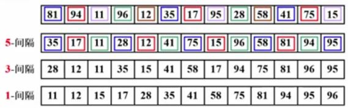
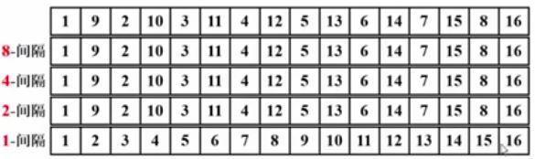
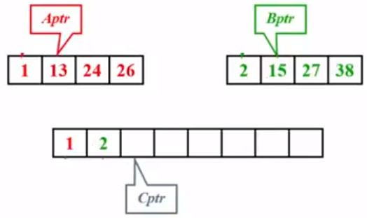
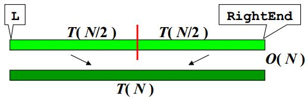

# 前提

## 统一接口

一般排序算法的统一接口如下：

```
void X_sort(ElementType A[], int N)
```

- N是正整数
- 只讨论基于比较的排序（> = <有定义）
- 只讨论内部排序：所有数据可以一次性导入内存，在内存内进行排序
- 稳定性：任意两个相等的数据，排序前后的位置不发生改变。

## 时间复杂度下界

- 对于下标 i < j，如果 A[i] > A[j] ，则称(i, j)是一对逆序对 (inversion)；
- 冒泡和插入排序都是交换两个相邻元素，正好消去1个逆序对；
- 他们的时间复杂度 T(N, I) = O(N, I)，那么如果序列基本有序，插入排序简单且高效；
- 定理：任意N个不同元素组成的序列平均具有 $\frac{N(N-1)}{4}$ 个逆序对；
- 定理：任何以交换相邻两个元素的排序算法，其平均时间复杂度为 $Ω(N^2)$ ;

所以如果想要提高速度，那么就要一次消去多个逆序对，也就是希尔排序的思想。


# 冒泡排序

从左往右扫描数组，比较相邻元素，不符合从小到大的顺序就相邻元素进行交换。

## 伪代码

```c
void bubble_sort(ElementType A[], int N) {
	for(P=N-1;P>=0;p--){
        flag = 0;
		for(i=0;i<P;i++) {
			if(A[i] > A[i+1]) {
				SWAP(A[i], A[i+1]);
                flag = 1;//标识发生了交换
			}
		}
        if(flag == 0) {break;}//全程无交换
	}

}
```

## 复杂度分析

- 最坏情况：序列全部逆序，T=O(N^2^)；
- 最好情况：序列全部顺序，T=O(N)；

## 优缺点

- 算法是稳定的；
- 对于待排序列是数组或者链表都可适用；


# 插入排序

  扫描数组，对于新拿到的数与前面排序好的数依次比较，并移动排序好的数，找到合适的位置放入。

  ## 伪代码

  ```c
  void bubble_sort(ElementType A[], int N) {
      for(P=1; P<N; P++) {
          temp = A[P]; // 拿下一张牌，其实就是缓存下一个数，因为待会要移数会覆盖
          for(i=P; i>0 && A[i-1]>temp; i--) {
              A[i] = A[i-1];//挨个移动有序数列，腾出空位
          }
          A[i] = temp;//新牌落位，就是找到了自己的位置
      }
  }
  ```

  ## 复杂度分析

  - 最坏情况：序列全部逆序，T=O(N^2^)；
  - 最好情况：序列全部顺序，T=O(N)；

  ## 优缺点

  - 算法是稳定的；


# 希尔排序



- 定义增量序列 $D_{M}>D_{M-1}>...>D_{1}=1$；
- 对于每一个 $D_{k}$ 进行 “$D_{k}$-间隔” 排序(k=M,M-1,...,1)；
- 然而这样有效的前提就是：“$D_{k}$-间隔” 有序的序列，在执行完 “$D_{k-1}$-间隔” 排序后，仍然是 “$D_{k}$-间隔” 有序的

## 原始的希尔排序

- $D_{M}=\left \lfloor N/2 \right \rfloor,D_{k}=\left \lfloor D_{k-1}/2 \right \rfloor$；

```c
  void shell_sort(ElementType A[], int N) {
      for(D=N/2; D>0; D/=2) {
          for(P=D; P<N; P++) {
              temp = A[P]; // 拿下一张牌，其实就是缓存下一个数，因为待会要移数会覆盖
              for(i=P; i>=D && A[i-D]>temp; i-=D) {
                  A[i] = A[i-D];//挨个移动有序数列，腾出空位
              }
              A[i] = temp;//新牌落位，就是找到了自己的位置
          }
      }

  }
```

- 最坏情况：$T=\Theta(N^{2})$ 既是上界又是下界



## 更多增量序列

- Hibbard 增量序列
  - $D_{k}=2^{k}-1$ 保证相邻元素互质；
  - 最坏情况： $T=\Theta(N^{3/2})$
  - 猜想：$T_{avg}=O(N^{5/4})$

- Sedgewick 增量序列
  - {1，5，19，41，109，...} — $9\times4^{i}-9\times2^{i}+1$ 或者 $4^{i}-3\times2^{i}+1$
  - 猜想：$T_{avg}=O(N^{7/6}), T_{worst}=O(N^{4/3})$

实际应用上，如果排序数量级在几万，那么使用希尔排序+Sedgewick 增量序列是比较好的选择

## 优缺点

- 算法**不是稳定的**；

# 选择排序

从未排序中的序列选出最小元放在有序序列的后面

## 伪代码

```c
void selsection_sort(ElementType A[], int N) {
	for(i=0; i<N; i++) {
        // 从A[i]到A[N-1]中找最小元，并将其位置赋值给MinPosition
        MinPosition = ScanForMin(A, i, N-1);
        // 将未排序部分的最小元放到有序部分的最后位置
        Swap(A[i], A[MinPosition]);
    }
}
```

## 复杂度分析

由于查找最小元的过程依旧是通过 for 循环查找，所以无论如何 $T=\Theta(N^{2})$ 


# 堆排序

如果是从小到大排序，则先构建最大堆，然后每次将最大元素和末尾元素互换，然后排除掉末尾元素，从位置 0 开始再调整为最大堆

## 伪代码

```c
    public void heap_sort(int[] A, int N) {
        for (int i = (N-1)/2; i >= 0 ; i--) {
            percDownMax(A, i, N); // 构建最大堆
        }
        for (int i = N-1; i > 0; i--) {
            swap(A, 0, i);
            percDownMax(A, 0, i);// 重新调整最大堆
        }
    }
```

## 复杂度分析

- 对于随机排列序列的平均时间复杂度是：$2NlogN-O(NloglogN)$；

- 但实际应用效果不如希尔排序+Sedgewick 增量序列；
- 对于一个数组直接调整为堆结构时间复杂度是$O(N)$，对n个元素用插入法建堆的时间复杂度是$O(NlogN)$；

# 归并排序

1. **其核心思想就是，有序子列的归并**

<center>
    
</center>

如果两个子列一共有N个元素，则时间复杂度显然是 $T(N)=O(N)$

```c
// L = 左边起始位置, R = 右边起始位置, RightEnd = 右边终点位置
void Merge( ElementType A[], ElementType TmpA[], int L, int R, int RightEnd ){ 
    LeftEnd = R - 1; // 左边终点位置。假设左右两列挨着
    Tmp = L; // 存放结果的数组的初始位置
    NumElements = RightEnd - L + 1;
    while( L <= LeftEnd && R <= RightEnd ) {
        if ( A[L] <= A[R] ) TmpA[Tmp++] = A[L++];
        else TmpA[Tmp++] = A[R++];
    }
    while( L <= LeftEnd ) // 直接复制左边剩下的
        TmpA[Tmp++] = A[L++];
    while( R <= RightEnd ) // 直接复制右边剩下的
        TmpA[Tmp++] = A[R++];
    for( i = 0; i < NumElements; i++, RightEnd -- )
        A[RightEnd] = TmpA[RightEnd];
}
```

2. **分而治之**

<center>
    
</center>

```c
void MSort( ElementType A[], ElementType TmpA[], int L, int RightEnd ) { 
    int Center;
    if ( L < RightEnd ) { // 分割到最小的就可以不用再分了
        Center = ( L + RightEnd ) / 2;
        MSort( A, TmpA, L, Center );
        MSort( A, TmpA, Center+1, RightEnd );
        Merge( A, TmpA, L, Center+1, RightEnd );
    }
}
```

3.**非递归**

<center>
    
</center>

## 复杂度分析

- $T(N)=T(N/2)+T(N/2)+O(N)$ ====> $O(NlogN)$

## 优缺点

- 算法是稳定的；
- 一般不做内排序，用于外排序；


# 快速排序

1. **选取主元 pivot**

2. **划分成两个独立子集**
3. **合并**

<center>
    
</center>

## 伪代码

```c
void Quicksort( ElementType A[], int N ) { 
    if ( N < 2 ) { return; }
    pivot = 从A[]中选一个主元;
	将S = { A[] \ pivot } 分成2个独立子集:
	A1={ a∈S | a ≤ pivot } 和
	A2={ a∈S | a ≥ pivot };
	A[] = Quicksort(A1,N1) ∪ {pivot} ∪ Quicksort(A2,N2);
	}
```

快速排序算法的最好情况就是每次选主元，都正好位于中间，此时的时间复杂度是 $T(N) = O(NlogN) $

1. **选主元**
   - 随机取 pivot？ rand()函数不便宜啊！
   - 取头、中、尾的中位数：例如 8、 12、 3的中位数就是8


<center>
    
</center>

2. **子集划分**

<center>
    
    <div style="font-size:15px">
    	<b/>这里 6 是主元，一开始在最右侧，最终放在了该放置的位置上
    </div>
</center>

  - 快速排序之所以快，就是每次子集划分，主元都会被放在最终的位置上，不会在变化
  - 如果有元素正好等于pivot怎么办？
     - 应该停下来交换，这样正好主元会被放在比较中间的位置，效率更高。

3. **小规模数据处理**
   - 快速排序的问题
       - 用递归，出栈入栈频繁
       - 对小规模的数据（例如N不到100）可能还不如插入排序快
   - 解决方案
       - 当递归的数据规模充分小，则停止递归，直接调用简单排序（例如插入排序）
       - 在程序中定义一个Cutoff的阈值 —— 课后去实践一下，比较不同的Cutoff对效率的影响 